# RetroArch Perfect Overlays for 640x480 Handhelds

## Preface

Some familiarity with RetroArch is beneficial. I have tried my best to lay everything out step by step, but I hope you can fill in the gaps if I forget something.

These overlays are derived from the work of [1playerinsertcoin](https://www.reddit.com/user/1playerinsertcoin/submitted/), with bezels added from [mugwomp_93](https://www.reddit.com/r/RG35XX/comments/1ai93ee/perfect_overlays_adapted_for_rg35xx/) and [drkhrse](https://github.com/drkhrse/drkhrse_miyoo_bezels).

These overlays have been adjusted and tested to fit Miyoo Mini v1/v2/v3/Plus, Retroid Pocket 2S, and RG405M. For the Miyoo Mini/Plus, OnionUI outputs GB/GBC 2 pixels left of center. Therefore, you will need to download specific overlays in the `miyoo` folder for these systems.

These overlays should theoretically fit other 640x480 displays with standard RetroArch build, but they've not been tested.

## Preview

| Perfect_CRT | Perfect_CRT-240p | Raw |
| -- | -- | -- |
| 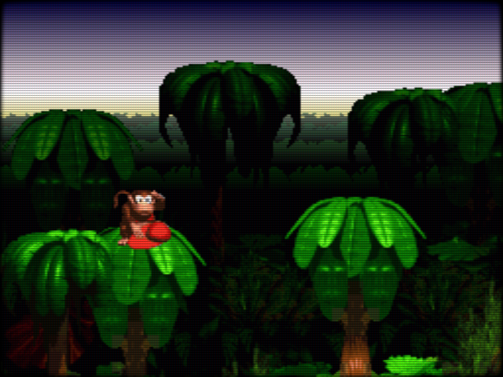 |  |  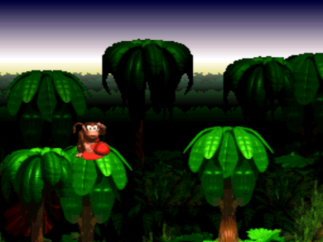 |

| Perfect_DMG-EX (mugwomp) | Perfect_DMG-EX (drkhrse) | Raw |
| -- | -- | -- |
| 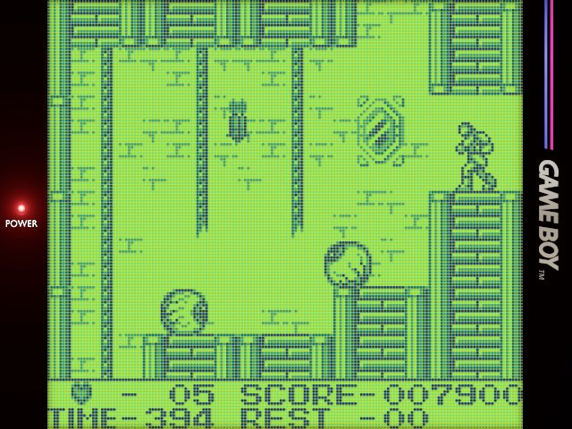 | 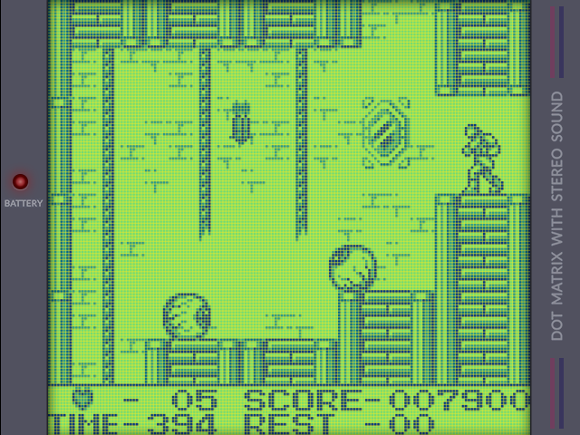 | 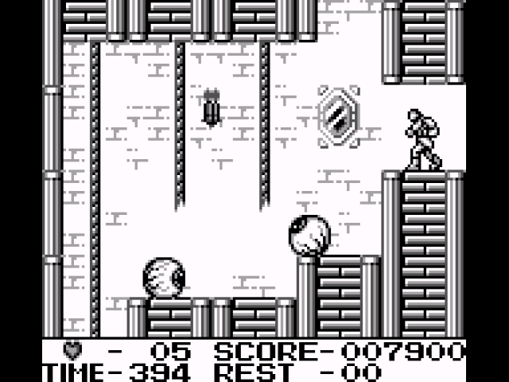 |

| Perfect_GBP-EX (mugwomp) | Perfect_GBP-EX (drkhrse) | Raw |
|-- | -- | -- |
| 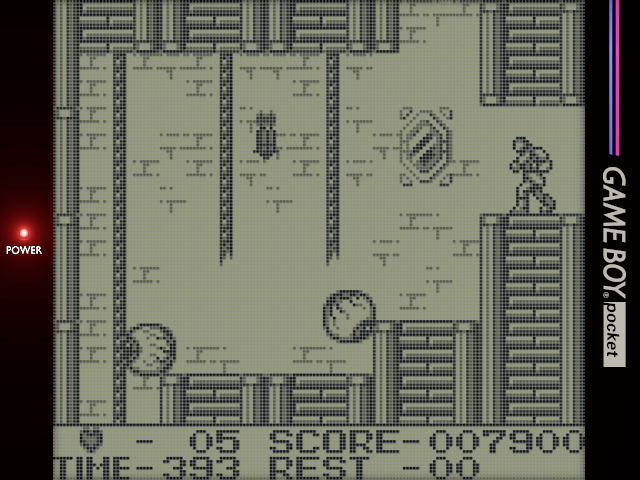 | 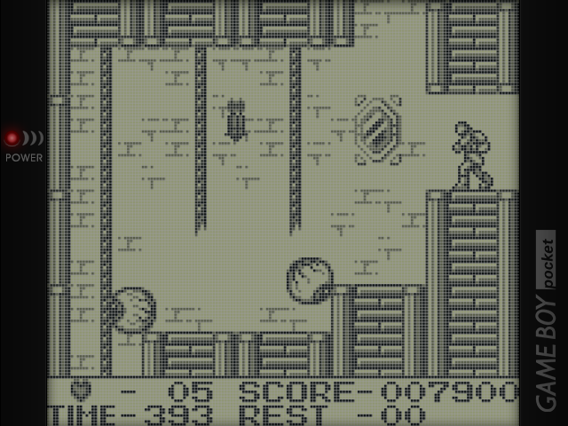 |  |

| Perfect_GBC (mugwomp)| Perfect_GBC (drkhrse)|Raw|
| -- | --| --|
| 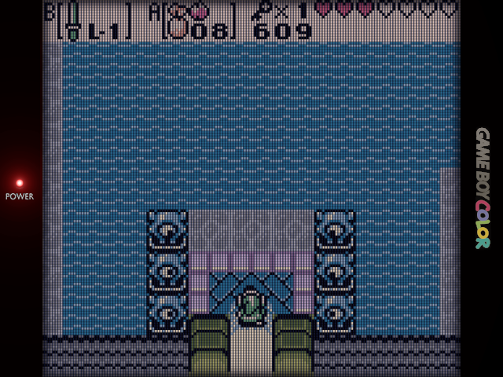 |  | 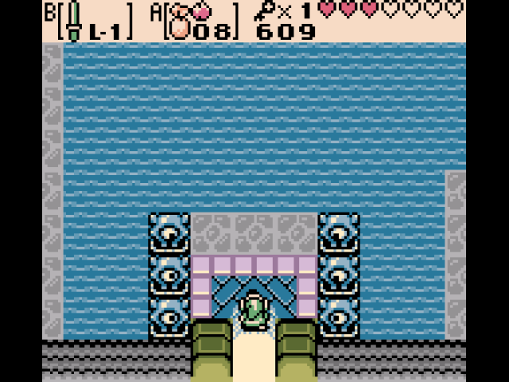|

|Perfect_GBA (mugwomp)| Perfect_GBA (drkhrse)| Raw |
|-- | -- | -- |
| 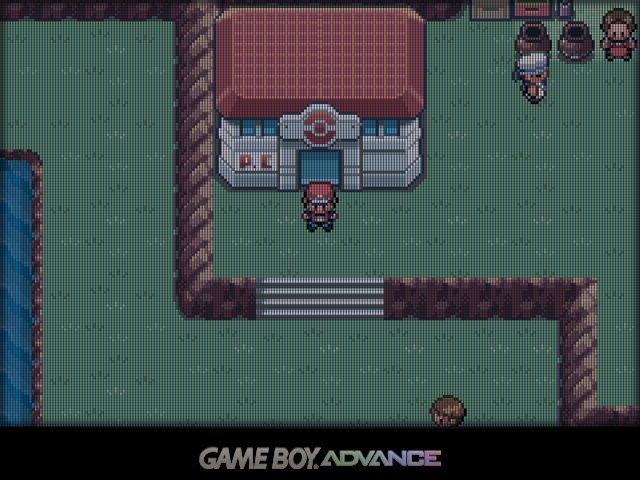 |  | 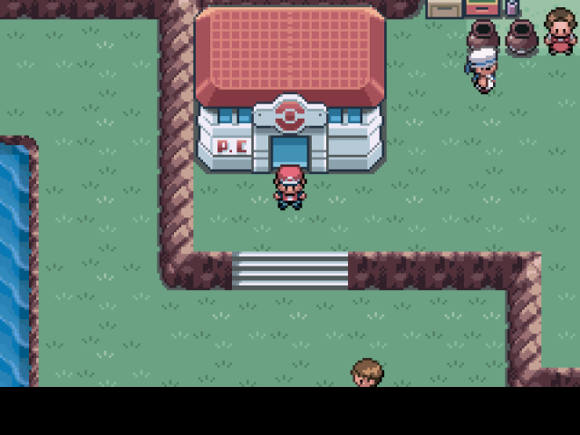 |

## Installation

Pick which version of the overlays you want, e.g. `drkhrse` or `mugwomp93`. Save both the `.png` and its `.cfg` to a `perfect_overlays` folder. For the Miyoo Mini/Plus on OnionUI, download the GB and GBC overlays specifically from the `miyoo` folder.

For the RG35XX-SP, you now also have the default GBA SP overlays seen in all promotional video with Perfect_GBA grid added. Find this in the `misc` folder. Thanks to [u/N4riN4ri](https://www.reddit.com/r/SBCGaming/comments/1czpgwt/those_who_have_received_the_rg35xxsp_could_you/l5kop9g/)!

On Android RetroArch installations, transfer the folder to `/data/user/0/com.retroarch/overlays` (default), or set your custom location.

* To find the default location, go to Android file manager, swipe from left side of screen, scroll to the bottom of the pullout menu, and click on `RetroArch` 

On OnionUI for Miyoo Mini, transfer the folder to `RetroArch/.retroarch/overlays`

On your device, start a game, then access RetroArch Quick Menu by your hotkey, then choose On-Screen Overlay > Display Overlay ON > scroll to Overlay Preset, and find the appropriate overlay

Next, ensure the following settings:
* Overlay Opacity > 1.00
* Auto-Scale Overlay > OFF
* Auto-Rotate OVerlay > OFF

**Then go back one menu > Overrides > Save Content Directory Overrides**. _[You will need to repeat this step after every configuration change](#)_

## Configuration

### CRT

Settings > Video:
* Integer Scale > OFF
* Aspect Ratio > 4:3

For SNES and NES, by default 8 pixels of overscan is cropped. This results in non-integer wonky scaling, which is evident in the "Mega Man life bar" test. For these, you may set the following:

* NES (FCEUmm)
  * Core Options:
   * Video > Crop Vertical Top/Bottom Overscan > 0
   * Manage Core Options > Save Game Options OR Content Directory Options
* SNES (snes9x)
  * Core Options:
   * Crop Overscan > OFF
   * Manage Core Options > Save Game Options OR Content Directory Options

### GB/DMG

Make a `palettes` folder in your `BIOS` directory and copy ONE `default.pal` (either `DMG` or `GBP`)  into `BIOS/palettes`.

Alternatively, for GBP I found that the shader `handheld > gb-palette-pocket` gives a more muted look. Turn GB Colorization OFF if using this shader.

Core Options: (Gambatte)
* GB Colorization > Custom
* Color Correction - Frontlight > Above Screen
* Interframe Blending > Simple _(Miyoo Mini)_ OR LCD Ghosting (Fast) _(More powerful systems)_
* Manage Core Options > Save Content Directory Options

Settings > Video:
* Integer Scale > OFF
* Aspect Ratio > Core Provided

Also for standard RetroArch builds, set:

Shaders:
* shaders_slang > interpolation > sharp-bilinear-2x-prescale.glsl
* Alternatively, use the sharp-shimmerless shader from [Woohyun-Kang/Sharp-Shimmerless-Shader](https://github.com/Woohyun-Kang/Sharp-Shimmerless-Shader)

### GBC

Core Options: (Gambatte)
* GB Colorization > GBC
* Color Correction > GBC Only
* Color Correction - Frontlight > Above Screen
* Interframe Blending > Simple _(Miyoo Mini)_ OR LCD Ghosting (Fast) _(More powerful systems)_
* Manage Core Options > Save Content Directory Options

Settings > Video:
* Integer Scale > OFF
* Aspect Ratio > Core Provided

Also for standard RetroArch builds, set:

Shaders:
* shaders_slang > interpolation > sharp-bilinear-2x-prescale.glsl
* Alternatively, use the sharp-shimmerless shader from [Woohyun-Kang/Sharp-Shimmerless-Shader](https://github.com/Woohyun-Kang/Sharp-Shimmerless-Shader)

### GBA

Settings > Video:
* Integer Scale > OFF
* For Miyoo Mini:
  * Video Filter > GBAOffset.filt
* For Standard RetroArch:
  * Aspect Ratio > Custom
    * X Position: 0
    * Y Position: 0
    * Width: 640
    * Height: 427

Core Options: (mGBA)
* Video > Color Correction > Game Boy Advance
* Video > Interframe Blending > Simple _(Miyoo Mini)_ OR LCD Ghosting (Fast) _(More powerful systems)_

Also for standard RetroArch builds, set:

Shaders:
* shaders_slang > interpolation > sharp-bilinear-2x-prescale.glsl
* Alternatively, use the sharp-shimmerless shader from [Woohyun-Kang/Sharp-Shimmerless-Shader](https://github.com/Woohyun-Kang/Sharp-Shimmerless-Shader)

Credits:
- [1playerinsertcoin](https://www.reddit.com/user/1playerinsertcoin/submitted/)
- [mugwomp_93](https://www.reddit.com/r/RG35XX/comments/1ai93ee/perfect_overlays_adapted_for_rg35xx/)
- [drkhrse](https://github.com/drkhrse/drkhrse_miyoo_bezels)
