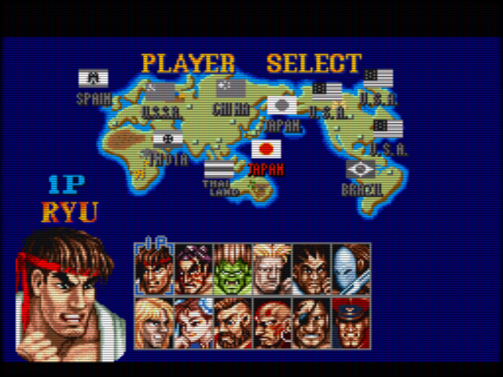
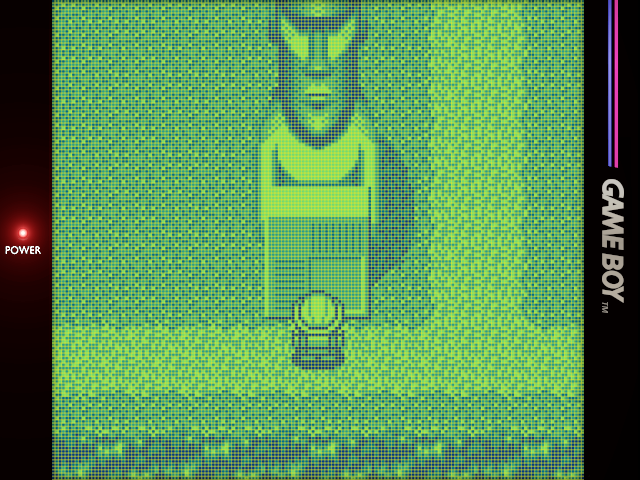
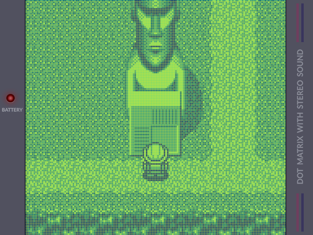
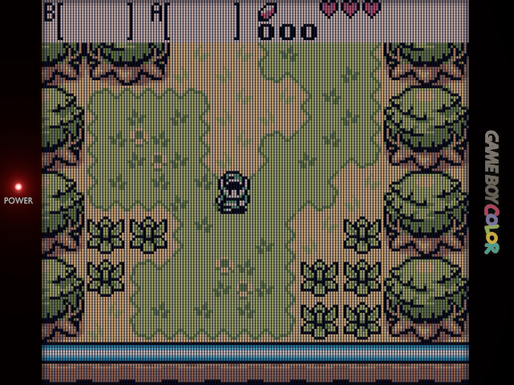
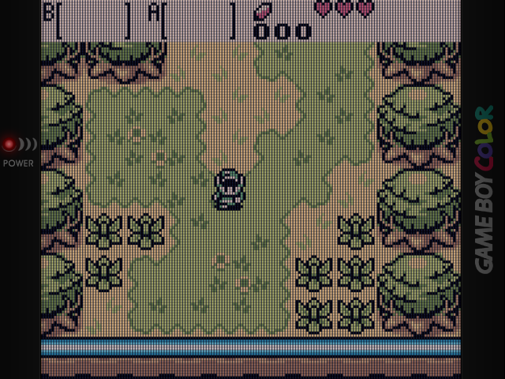
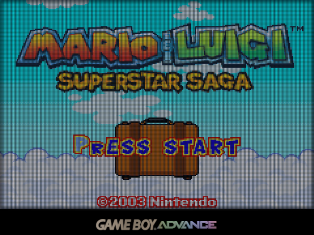
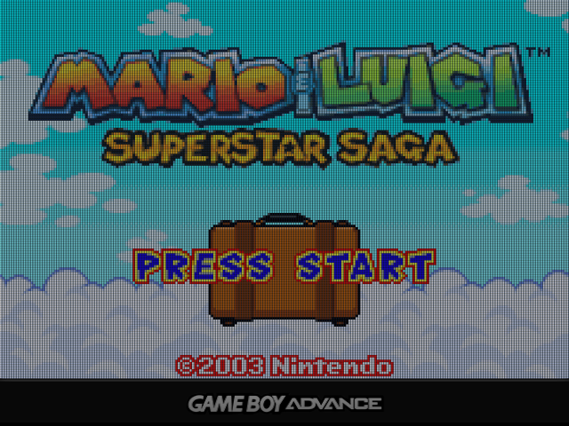

# RetroArch Perfect Overlays for 640x480 Handhelds

:warning: Work In Progress :warning:

## Preface

This guide requires some familiarity with RetroArch, or at least reading and critical thinking skills :stuck_out_tongue_winking_eye:

I have tried my best to lay everything out step by step, but I hope you can fill in the gaps if I forget something.

OnionUI for the Miyoo Mini outputs GB/GBC 2 pixels left of center. Therefore, you will need to download specific overlays in the `miyoo` folder for these systems.

## Preview

| Perfect_CRT                   | Perfect_CRT-240p                      | 
| ----------------------------------- | ----------------------------------- |
|  |  | 

| Perfect_DMG-EX (mugwomp93 bezel)                    | Perfect_DMG-EX (drkhrse bezel)                      | 
| ----------------------------------- | ----------------------------------- |
|  |  | 

| Perfect_GBC (mugwomp93 bezel)                    | Perfect_GBC (drkhrse bezel)                      | 
| ----------------------------------- | ----------------------------------- |
|  |  | 

| Perfect_GBA (mugwomp93 bezel)                    | Perfect_GBA (drkhrse bezel)                      | 
| ----------------------------------- | ----------------------------------- |
|  |  | 

| Perfect_CRT                   | Perfect_CRT-240p                      | 
| ----------------------------------- | ----------------------------------- |
|  |  | 

## Installation

On Android RetroArch installations, save the files to `/data/user/0/com.retroarch/overlays` (default), or your custom `overlay` folder in the home directory.

* To find the default location, go to Android file manager, swipe from left side of screen, scroll to the bottom of the pullout menu, and click on `RetroArch` 

On OnionUI for Miyoo Mini, save the files to `RetroArch/.retroarch/overlays`

While in game, go to RetroArch Quick Menu by your hotkey, then choose On-Screen Overlay > Display Overlay ON > Overlay Preset, and select the overlay

Next, ensure the following settings:
* Overlay Opacity > 1.00
* Auto-Scale Overlay > OFF
* Auto-Rotate OVerlay > OFF

Then go back one menu > Overrides > Save Content Directory Overrides

## Configuration

### CRT

Settings > Video:
* Integer Scale > OFF
* Aspect Ratio > 4:3

Additionally, for the "Mega Man life bar" test, set the following:

* SNES (snes9x)
  * Core Options > Crop Overscan > OFF
* NES (FCEUmm)
  * Core Options > Video > Crop Vertical Top/Bottom Overscan > 0

### GB/DMG

Settings > Video:
* Integer Scale > OFF
* Aspect Ratio > Core Provided

### GBC

Settings > Video:
* Integer Scale > OFF
* Aspect Ratio > Core Provided
  
### GBA

Settings > Video:
* Integer Scale > OFF
* For Standard RetroArch:
  * Aspect Ratio > Custom
    * X Position: 0
    * Y Position: 0
    * Width: 640
    * Height: 427
* For OnionUI for Miyoo Mini:
  * Video Filter > GBAOffset.filt

Credits:
- [1playerinsertcoin](https://www.reddit.com/user/1playerinsertcoin/submitted/)
- [mugwomp_93](https://www.reddit.com/r/RG35XX/comments/1ai93ee/perfect_overlays_adapted_for_rg35xx/)
- [drkhrse](https://github.com/drkhrse/drkhrse_miyoo_bezels)
